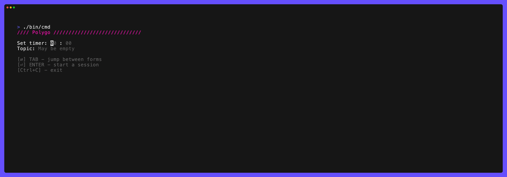

# polygo

> I made this app for personal usage, but I do not see reasons to keep it private

## What is it? 
`Polygo` is a terminal-based app for conducting brainstorming sessions. It allows to set a timer, generate ideas as short Markdown notes, rank them, and save the ordered results to a `.md` file.

## Features

- __Timed Brainstorm Sessions__: Start with a configurable timer (in minutes and seconds) to structure the idea generation process.
- __Idea Generation__: Use a split-screen interface—enter notes on the left, and view the accumulating list on the right.
- __Ranking Round__: After the timer ends, rank ideas by swiping left to keep or right to mark it as "polishing needed".
- __Markdown Export__: Save the ranked ideas to a `.md` file for later use (e.g. with Obsidian).